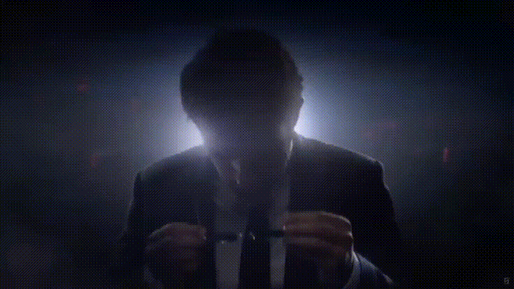

 

<!-- ==================== ANIMATED INTRO ==================== -->

  

<!-- ==================== DIVIDER ==================== -->

  

<!-- ==================== ANIMATED GIF BANNER ==================== -->

  

<!-- ==================== SYSTEM STATUS ==================== -->

### ⚡ `SYSTEM STATUS`

 

  

 

### 🐍 `CONTRIBUTION SNAKE`

