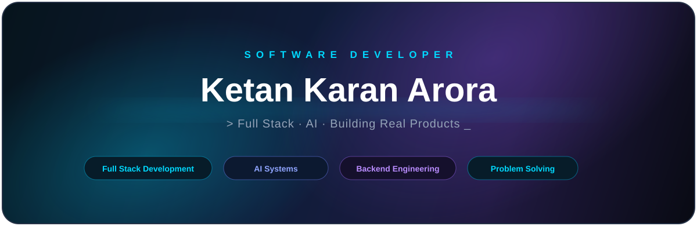

<!-- ==================== DIVIDER ==================== -->

  

<!-- ==================== ANIMATED GIF BANNER ==================== -->

  

<!-- ==================== SYSTEM STATUS ==================== -->

### ⚡ `SYSTEM STATUS`

 

  

 

<!-- ------------------------------------------------------------------ -->

<h2>⚡ Tech Stack</h2>

<!-- Languages -->

  

<!-- Frontend -->

  

<!-- Backend -->

  

<!-- Databases -->

  

<!-- Tools -->

  

 

<!-- Frameworks & Technologies -->

 

 

### 🐍 `CONTRIBUTION SNAKE`

